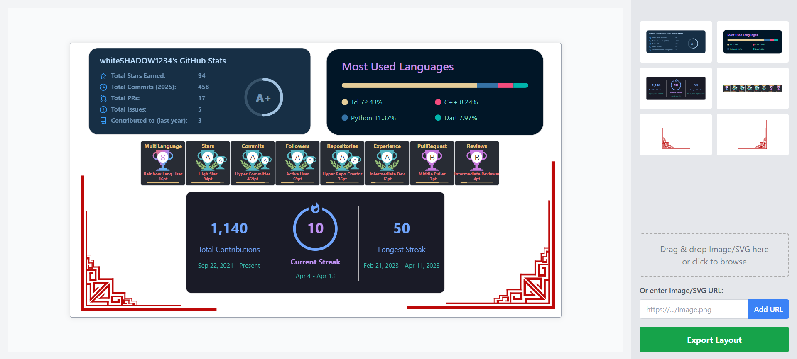

# ✨ Profile Board ✨

A simple, interactive web application allowing users to upload assets (images, text snippets) and arrange them visually on a canvas. Built with React, TypeScript, and Tailwind CSS. Drag, drop, resize, and export your layout!




## 🤔 What is Profile Board?

Profile Board provides a flexible canvas where you can:

*   **Upload** your images or add text snippets.
*   **Drag and drop** these assets onto a workspace.
*   **Position and resize** items freely on the canvas.
*   **Delete** items you no longer need.
*   **Export** the final layout (positions and dimensions of items) as JSON data to your clipboard.

Once you have exported your layout as JSON, you can use this data with the [`profileBoard` GitHub Action](https://github.com/whiteSHADOW1234/profileBoard) to automatically build a customized SVG representation of your board. This generated SVG is perfect for showcasing your design directly on your GitHub Profile!

## 🚀 Features

*   **Asset Upload:** Upload images directly from your device. (Text snippet upload could be a future addition).
*   **Interactive Canvas:** Uses SVG for rendering items, allowing smooth interaction.
*   **Drag & Drop:** Easily add items from the sidebar to the canvas or reposition existing items.
*   **Resize Items:** Adjust the width and height of items on the canvas.
*   **Delete Items:** Remove individual items from the canvas or uploaded assets from the sidebar.
*   **Layout Export:** Copy the structure of your canvas items (ID, type, position, dimensions) as JSON to the clipboard.
*   **Responsive Design:** Basic responsiveness for different screen sizes.
*   **Clean UI:** Built with Tailwind CSS for a modern look.

## 🛠️ Tech Stack

*   **Frontend:** React
*   **Language:** TypeScript
*   **Styling:** Tailwind CSS
*   **Canvas Rendering:** SVG (via React components)
*   **State Management:** React Hooks (`useState`, `useEffect`)
*   **Build Tool:** Vite

## ⚙️ Getting Started

To get a local copy up and running, follow these simple steps.

### Prerequisites

*   Node.js (v18 or later recommended)
*   npm, yarn, or pnpm

### Installation

1.  **Clone the repo:**
    ```bash
    git clone https://github.com/whiteSHADOW1234/Profile-Board.git
    cd Profile-Board
    ```
2.  **Install dependencies:**
    ```bash
    npm install
    # or
    yarn install
    # or
    pnpm install
    ```
3.  **Run the development server:**
    ```bash
    npm run dev
    ```

4.  Open your browser and navigate to `http://localhost:5173` (or the port specified by your dev server).

## 🎨 Usage

1.  **Upload Assets:** Use the sidebar to upload image files. They will appear in the "Uploaded Assets" list.
2.  **Add to Canvas:** Drag an asset from the sidebar onto the main canvas area.
3.  **Manipulate Items:**
    *   Click and drag an item on the canvas to move it.
    *   Click an item to select it. 
    *   Drag the handles to resize.
    *   Press the `Delete` icon when an item is selected will remove it from the canvas.
4.  **Delete Uploaded Assets:** Click the delete icon next to an asset in the sidebar to remove it from the list **and** from the canvas.
5.  **Export Layout:** Click the "Export Layout" button in the sidebar. The JSON representation of your canvas items will be copied to your clipboard.

## 💾 Export Format

The exported JSON is an array of objects, where each object represents an item on the canvas:

```json
[
  {
    "id": "unique-item-id-1",
    "url": "blob:http://localhost:5173/...", // Or potentially a data URL or original path
    "type": "image", 
    "x": 50,        
    "y": 50,       
    "width": 100,   
    "height": 100   
  },
  // ... more items
]
```
# 🙏 Contributing
Contributions are what make the open-source community such an amazing place to learn, inspire, and create. Any contributions you make are greatly appreciated!

1. Fork the Project (Click the 'Fork' button in the top right)
2. Create your Feature Branch (git checkout -b feature/AmazingFeature)
3. Commit your Changes (git commit -m 'feat: Add some AmazingFeature')
4. Push to the Branch (git push origin feature/AmazingFeature)
5. Open a Pull Request
Please ensure your code adheres to standard practices and includes comments where necessary.

If you find a bug or have a feature request, please open an issue.

Don't forget to give the project a star! ⭐ Thanks!

# 📜 License
Distributed under the MIT License. See LICENSE file for more information.